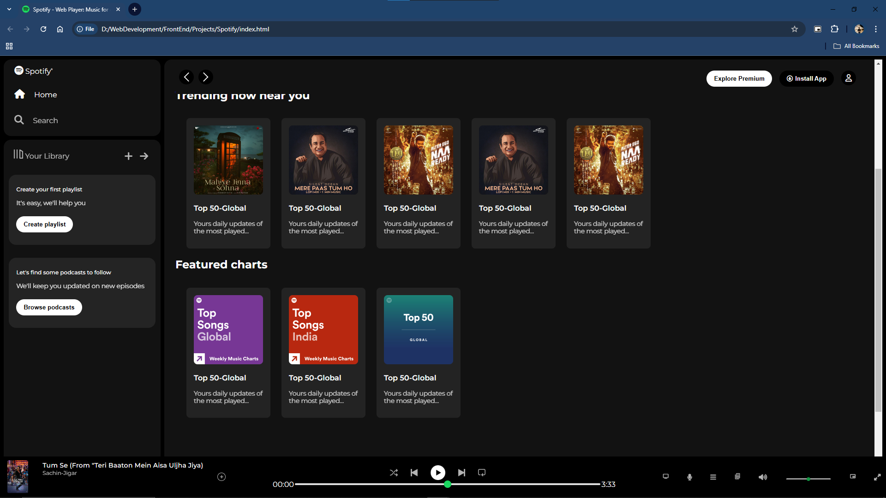

Spotify Clone 🎵

A fully responsive Spotify Clone designed to emulate the user interface of the popular music streaming platform. This project demonstrates proficiency in HTML, CSS, and the use of Google Fonts, creating an interactive and visually appealing frontend.

🖥️ Project Overview
This Spotify Clone features a clean and modern design, focusing on replicating Spotify's aesthetics while maintaining responsiveness for devices of all sizes.

Key Features
Responsive Design: Seamlessly adapts to different screen sizes, from desktops to mobile devices.
Clean UI: Designed with attention to detail to mimic Spotify's minimalist interface.
Core Technologies: Built purely using HTML, CSS, and Google Fonts.
Custom Assets: Enhanced with curated assets for a polished look.

📷 Preview
  

🛠️ Technologies Used
HTML5
CSS3
Google Fonts

📂 Folder Structure
/  
├── index.html      # Main HTML file  
├── css/            # Folder containing CSS files  
│   └── styles.css  # Main stylesheet  
├── assets/         # Folder containing images and other assets  
├── screenshots/    # Folder containing project screenshots  
│   └── preview.png # Screenshot of the project preview  
└── README.md       # Project documentation  

🌟 How to Run Locally

1. Clone the repository:
 git clone https://github.com/your-username/spotify-clone.git
2. Navigate to the project directory:
   cd responsive-spotify-clone
3. Open index.html in your browser to view the project.

   🤝 Contributions
Contributions are welcome! Feel free to fork the repository, create a new branch, and submit a pull request with your improvements.

📧 Contact
For any questions or suggestions, feel free to contact me at [adarsh99dev@gmail.com].

